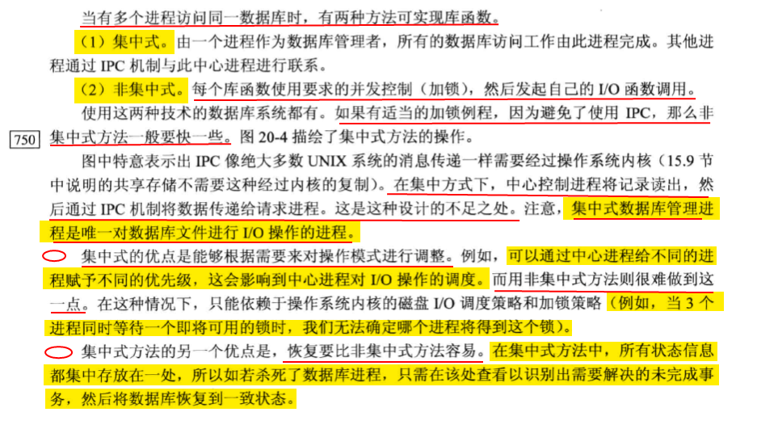

# 数据库函数库


## 20.3 函数库

> #include "apue_db.h"

### db_open db_close

```c++
DBHANDLE db_open(const char *pathname, int oflag,.../* int mode */);
		// 返回值： 若成功，返回数据库句柄；若失败，返回NULL
void db_close(DBHANDLE db);
```


### db_store 存入

```c++
int db_store(DBHANDLE db, const char *key, const char *data, int flag);
			//返回值： 成功返货0， 出错返回非0值（见下）
```


### db_fetch 获取


### db_delete 删除


### db_rewind db_nextrec 逐条访问


## 20.4 实现概述

*有许多技术可用来组织索引文件以提高按键查询的速度和效率，**散列表和B+树**是两种常用的技术。*

**采用固定大小的散列表来组织索引文件组织，并采用链表法解决散列冲突。**


### 实现结构


## 20.5 集中式或非集中式

>1.集中式
>
>2.非集中式




**调用数据库库函数执行I/O的用户进程是合作进程，他们使用字节范围记录锁机制来实现并发控制。**

## 20.6 并发

> 1 粗粒度锁
>
> 2 细粒度锁


## 20.9 性能

> 不加锁 
>
> 建议性锁
>
> 强制性锁

